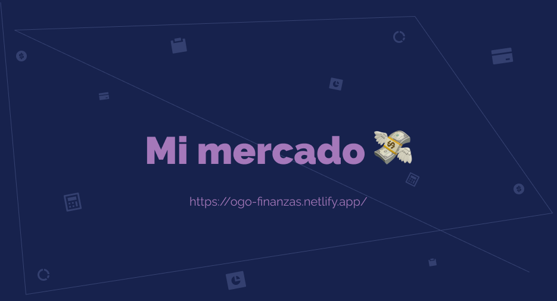

---

CON OGO PODRAS SABER UN POCO **COMO ES TU REALIDAD FINANCIERA ACUTALMENTE**, Y EN BASE A LOS DATOS ARROJADOS PODRAS TOMAR ACCIÓN EN CAMBIAR TU ENTORNO FINANCIERO.

Podrás crear un presupuesto, para controlar tus gastos, saber cuánto dinero te ingresa y como manejas todo esto. La misión de ogo? que seas _más consiente de como están tus finanzas_. Porque:

> “_Lo que no está escrito no puede ser medible, lo que no es medible no puede ser cambiado_”

---

---

---

## **Este proyecto esta construido con:**

## **Licencia**

- **_MIT_**
